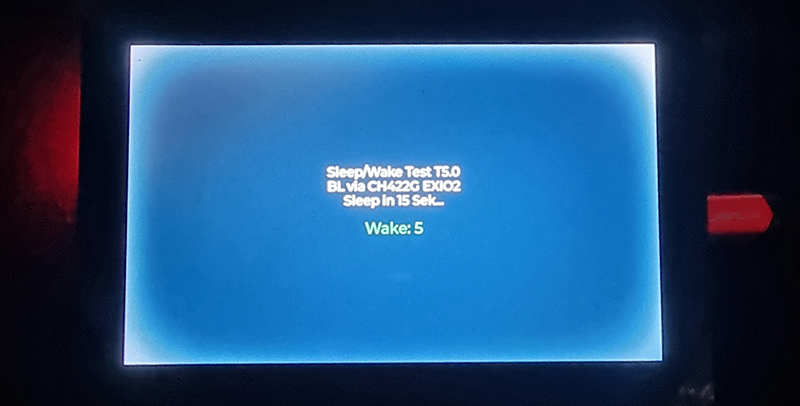
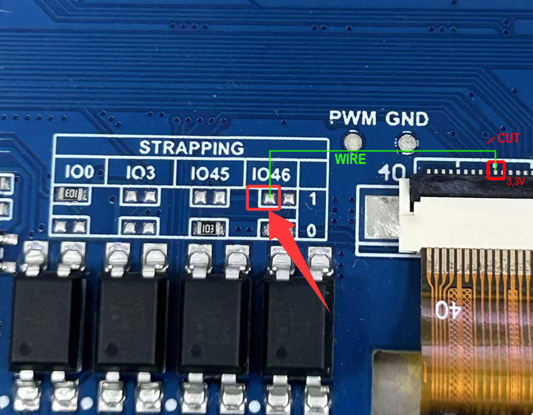

# Waveshare-ESP32-S3-Touch-LCD-5-Backlight-White-Halo-Fix
Fix for white halo artifacts on Waveshare ESP32-S3-Touch-LCD-5 after backlight off/on (screensaver) hardware mod

The Problem

When using the Waveshare ESP32-S3-Touch-LCD-5 (1024×600) with a screensaver function (backlight off, wake on touch), a white halo / burn-in artifact appears on the display after the backlight has been off for approximately 3-5 minutes.

The artifact is visible immediately after the backlight turns back on and slowly fades away.

Symptoms:

White glow around the edges or corners of the display
Appears only after backlight off → on cycle
Gets worse the longer the backlight stays off
Not related to software, LVGL version, or buffer mode
What Does NOT Fix It (Software)
All of the following were tested without success:

Keeping LVGL and RGB DMA running during backlight off
Stopping RGB DMA before backlight off
LCD panel hardware reset (RST LOW/HIGH)
PWM fade-in on backlight (slow ramp-up)
Minimum brightness (3%) instead of full off
Anti-tearing mode changes (Mode 0, 1, 2, 3)
Double / triple frame buffer
Waveshare Support
Ticket was opened with Waveshare support including a minimal reproducible test sketch. Their response:

"We have reproduced this issue and are currently seeking a solution."

After follow-up, Waveshare provided a hardware fix and stated:

"We plan to redesign the development board as a future step."

This confirms it is a hardware design issue on the board.

The Hardware Fix
Waveshare identified that a trace connected to the left pad of GPIO46 (in the STRAPPING area) needs to be modified.

What to do:

Step 1 — Cut the trace

On the back of the board, near the LCD connector (pin 40 area), cut the trace shown in the Waveshare photo (the diagonal line indicates where to cut).

Step 2 — Connect to 3.3V

Run a jumper wire from the now-disconnected pin to the left pad of GPIO46 in the STRAPPING area on the front of the board. This pad is connected to 3.3V.

Result:

The LCD panel's internal charge circuit stays stable even when the backlight is off. No more white halo after wake.

⚠️ This requires soldering. Proceed at your own risk.

Test Results

After the hardware modification:

-36+ hours of operation with repeated sleep/wake cycles

-Zero artifacts observed

-Screensaver (backlight off via CH422G EXIO2) works perfectly

Affected Hardware

-Waveshare ESP32-S3-Touch-LCD-5 (1024×600) Rev 1.1

-Possibly also Rev 1.0 and the 800×480 variant (not tested)
